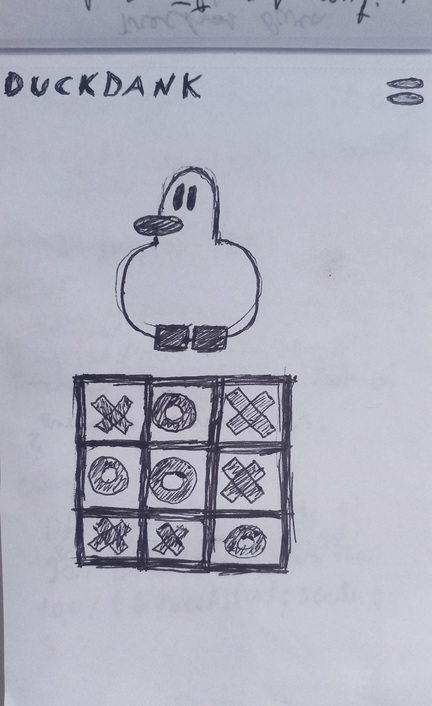

## __Hello!! Esse é o readme do projeto DuckDank__ 🙃🙂

Você pode acessar o game por esse [link](https://lauanda1327.github.io/DuckDank/) 👈

Bom...Para desenvolver esse projeto foi utilizado as linguagens:
HTML, CSS e JavaScript

- HTML para a estrutura
- CSS para a estilização
- JavaScript para a interação e lógica

*A ideia principal era a criação de um simples jogo da velha em que o adversário é o computador. Para deixar o jogo mais dinâmico, isto é, diferente..., tive a ilustre ideia de adicionar um personagem para interação. O personagem(bot, ia, etc...) tem em seu código diversos algoritmos que dão a ele maior interatividade. __Por exemplo:__*

Existe algoritmo para tempo de surgimento do __miniDuck__, algoritmo para analisar jogadas do usuario, algoritmo para criar as animações do duckdank e muitos outros algoritmos responsáveis desde a execução de áudios a animação do personagem.

### Para deixar as coisas mais dinâmicas...
#### Essa era a ideia inicial do projeto:

#### Esse é o resultado final em um dispositivo mobile padrão:

### isso é tudo...

[https://duckdankgo.web.app/](https://duckdankgo.web.app/)

